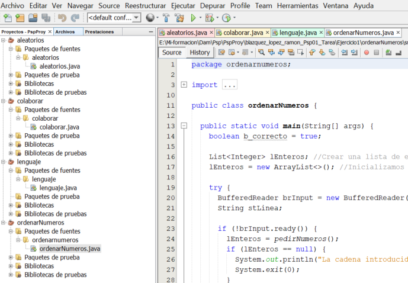
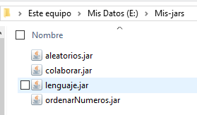
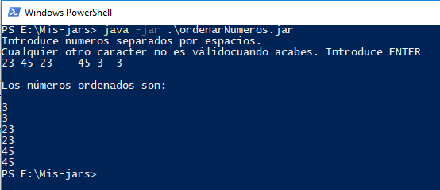
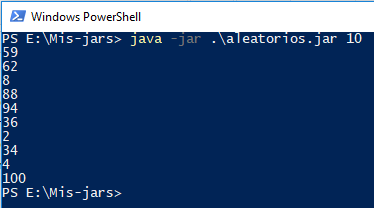
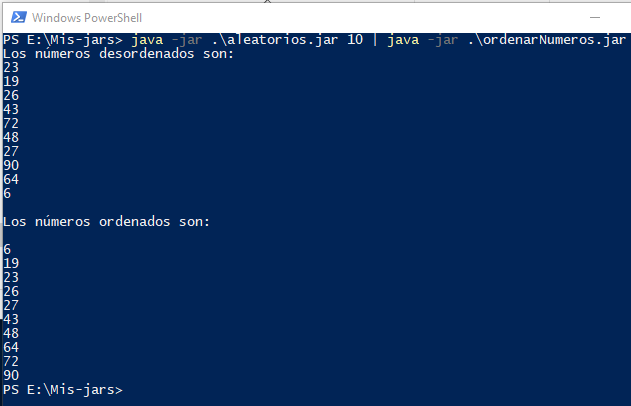
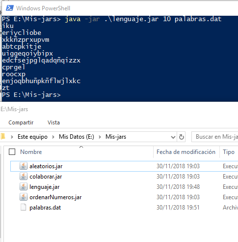
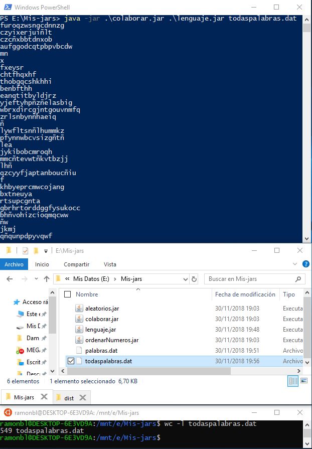

# blazquez_lopez_ramon_psp01_tarea

> Tarea del tema 1 de Programación de Servicios y Procesos

La tarea consta  de dos ejercicios. 

1. **Ejercicio 1.**

   Está compuesta por dos proyectos:

   1. `ordenarNumeros`

      Aplicación que recibe una serie de números por su entrada estándar.

      Si la entrada estándar es el teclado, nos pide una cadena con números separados por espacios como si se tratase de argumentos recibidos.

      Si no lo es, recoge la salida estándar de otro programa (aleatorios).

      Posteriormente los ordenará y los mostrará por pantalla.

      **No se tendrá en cuenta la la función `RecibirNumeros`**.

   2. `aleatorios`

      Programa que generará una cantidad de números aleatorios entre 1 y 100.

      La cantidad le será dada mediante un argumento.

      Sacará por la salida estándar los números generados

2. **Ejercicio 2.**

   Está compuesto por dos proyectos.

   1. `lenguaje`

      Crea N conjuntos de palabras aleatorias y las guarda en un archivo a través de un RAF.

      N será recibido como argumento; así como el archivo en el que se guardará.

      Las palabras estarán formadas con letras minúsculas y su longitud también será aleatoria.

      Las escribirá en el archivo que enviemos como argumento.

      Tendrá una sección crítica para solucionar problemas de concurrencia.

   2. `colaborar`

      Ejecuta 10 instancias de un programa java que se le pasará como parámetro `lenguaje` (con los argumentos que éste mismo necesita).




## Instalación

El IDE usado ha sido **Netbeans**. (Está en proyecto aprender a usar Eclipse)

La razón es que me resulta cómodo para la programación en Java y no tenía tiempo para habituarme a Eclipse (aunque prefería probar otros como *Visual Studio Code* o *Atom*)

```git
git clone https://github.com/dam-ramonbl/blazquez_lopez_ramon_psp01_tarea.git
git checkout 37ed449504842c63b02465df255de0b6bb1b85df
```

Para simplificar la prueba de los programas es recomendable guardarlos en la misma carpeta. 

En mi caso, los he guardado en `E:\Mis-jars`.



Los archivos generados, tb lo harán en esa carpeta para evitar escribir rutas largas.


## Ejemplo de uso

### Ejercicio 1 

#### `ordenarNumeros.java`

Escribiremos los números unos detrás de otros con los espacios que consideremos por el medio.



####  `aleatorios.java`

Lo hacemos para 10 números para evitar hacer imágenes muy largas.



####  `aleatorios | ordenarNumeros`

Usamos tubería:



### Ejercicio 2

#### `lenguaje.java`



#### `colaborar.java`



Al abrir el fichero en notepad++ nos da las 550 líneas (no se por qué el wc da una línea menos).


## Configuración de desarrollo


## Historial de versiones
  - Trabajo en progreso

## Meta

Ramón Blázquez Lopez – [@dam-ramonbl](https://github.com/dam-ramonbl) – dam.ramonbl@gmail.com

Distribuido bajo la licencia XYZ. Ver ``LICENSE`` para más información.

[dam-ramonbl/blazquez_lopez_ramon_psp01_tarea: Tarea del tema 1 de Programación de Servicios y Procesos](https://github.com/dam-ramonbl/blazquez_lopez_ramon_psp01_tarea)

------

